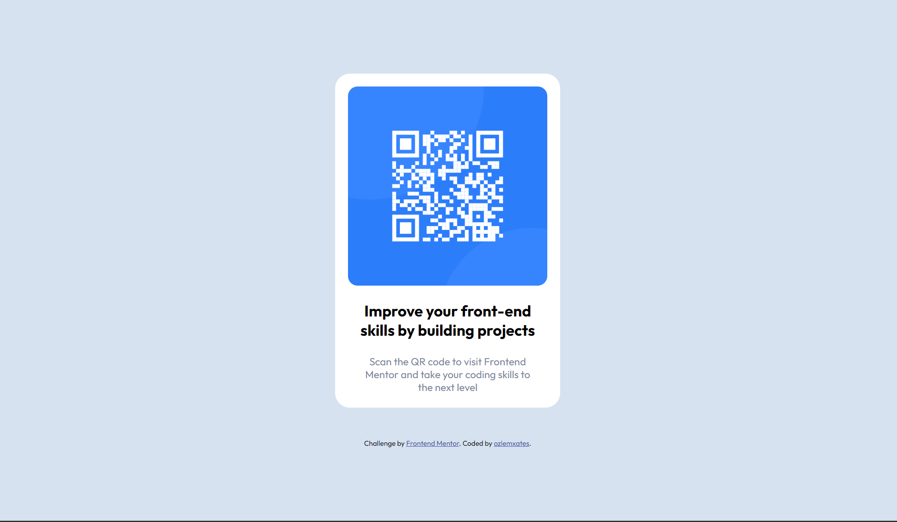

# Frontend Mentor - QR code component solution

This is a solution to the [QR code component challenge on Frontend Mentor](https://www.frontendmentor.io/challenges/qr-code-component-iux_sIO_H).

## Table of contents
  - [The challenge](#the-challenge)
  - [Built with](#built-with)
  - [Screenshots](#screenshots)
  - [Links](#links)
  - [Author](#author)

### The challenge 
Users should be able to:

- View the optimal layout for the app depending on their device's screen size

### Built with

- Semantic HTML5 markup
- CSS custom properties
- CSS Flexbox

### Screenshots

### Links

- Solution URL -> [Click here](https://www.frontendmentor.io/solutions/creating-qr-code-display-screen-by-using-basic-html-and-css-ZYQvcRFdud)
- Live site URL -> [Click here](https://ozlemxates.github.io/QR-Code-FM-Challange/)

### Author

- GitHub - [ozlemxates](https://github.com/ozlemxates)
- Frontend Mentor - [@ozlemxates](https://www.frontendmentor.io/profile/ozlemxates)

### Thank you for checking out! 🎉